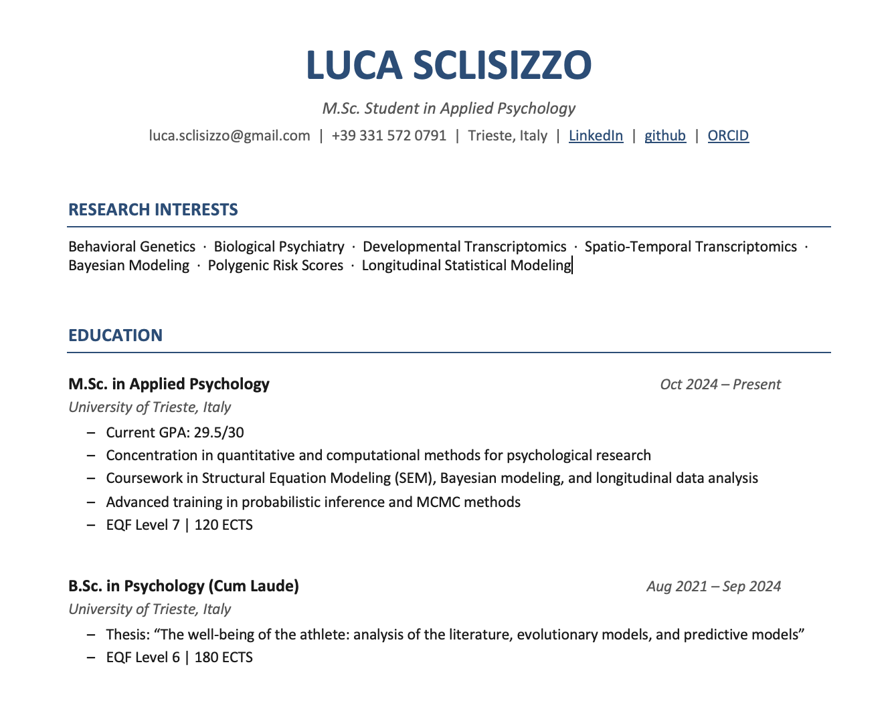

# Academic CV Generator

Programmatic generator for an academic curriculum vitae in **Microsoft Word (.docx)** format, built with **Node.js** and the [`docx`](https://github.com/dolanmiu/docx) library.

The CV is generated from structured data and a reusable document template, allowing rapid updates, consistent formatting, and easy customization for different academic purposes (PhD applications, research positions, fellowships, conferences, etc.).

## Preview
An example of the generated CV with this template:



------------------------------------------------------------------------

## Getting Started

### Clone the repository

Clone the repository from GitHub:

``` bash
git clone https://github.com/Luca-Sclisizzo/academic-cv-generator.git
```

Move into the project directory:

``` bash
cd academic-cv-generator
```

### Install dependencies

Install the required Node.js dependencies:

``` bash
npm install
```

This command uses the `package.json` and `package-lock.json` files to install the required packages and ensure reproducible dependency versions. Make sure these files are present in the project directory after cloning the repository.

### Generate the CV

Run the generator script:

``` bash
node cv_academic_generator.js
```

A new `.docx` file will be generated automatically in the configured output directory.

Running the script again will recreate the document using the current data and overwrite the previous file with the same name.

------------------------------------------------------------------------

## Project Structure

``` text
academic_cv_generator/
├── cv_academic_generator.js   # Main generator: document structure and formatting
├── cv_data.js                 # CV content: personal information, education, research, etc.
├── config.js                  # Output configuration (filename and directory)
├── package.json               # Project dependencies
├── package-lock.json
└── CV_academic/               # Output folder, generated CV files
```

------------------------------------------------------------------------

## How It Works

The generator separates **CV content** from **document formatting**.

### `cv_data.js`

Contains all information included in the CV:

- personal information;
- research interests;
- education;
- research experience;
- conference presentations;
- work in progress;
- awards;
- technical skills;
- professional experience;
- languages.

Updating the CV only requires modifying this file.

### `cv_academic_generator.js`

Contains the document generation logic:

- page layout;
- typography and styles;
- section formatting;
- reusable formatting functions;
- conversion of structured data into a Word document.

### `config.js`

Controls the output settings:

- output directory;
- generated filename.

Example:

``` javascript
module.exports = {
  outputDirectory: "./CV_academic",
  fileName: "CV_MyName.docx"
};
```

------------------------------------------------------------------------

## Output

The generated document is saved according to the configuration specified in `config.js`.

Example:

``` text
CV_academic/
└── CV_MyName.docx
```

Running the generator again:

``` bash
node cv_academic_generator.js
```

will recreate the document using the current data and overwrite the previous file with the same name. By default, generated documents are saved in the `CV_academic/` directory.

------------------------------------------------------------------------

## Customization

To update the CV:

1.  Modify the content in `cv_data.js`.
2.  Adjust the output settings in `config.js` if needed.
3.  Run:

``` bash
node cv_academic_generator.js
```

The updated `.docx` file will be generated automatically.

Different CV versions can be created by using alternative data files while keeping the same generator. For example:

``` text
cv_data_phd.js
cv_data_postdoc.js
cv_data_industry.js
```

------------------------------------------------------------------------

## Technology Stack

| Component           | Details                |
|---------------------|------------------------|
| Language            | JavaScript (Node.js)   |
| Document generation | `docx` (\^9.7.1)       |
| Module system       | CommonJS (`require`)   |
| Output format       | Microsoft Word (.docx) |

------------------------------------------------------------------------

## Why a Programmatic CV?

Maintaining an academic CV as code provides several advantages:

- reproducible formatting across versions;
- fast updates without manually editing Word documents;
- consistent structure and typography;
- easy creation of tailored CV versions;
- version control through Git;
- separation between content and presentation.

This approach is particularly useful for academic careers, where research activities, publications, conferences, grants, and collaborations evolve frequently.

------------------------------------------------------------------------

## Author

**Luca Sclisizzo**
